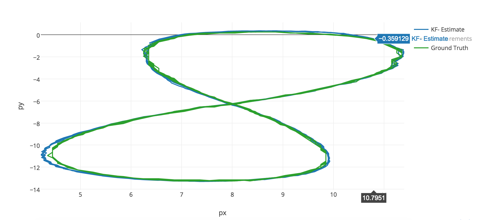

# Extended Kalman Filter Project Starter Code
Self-Driving Car Engineer Nanodegree Program

Implementation of an Extended Kalman Filter using C++.

## Results

### Data Set 1
|     | RMSE      |
| --- |:---------:| 
| px  | 0.0729152 | 
| py  | 0.0817211 | 
| vx  | 0.562461  | 
| vy  | 0.564008  | 

### Data Set 2
|     | RMSE      |
| --- |:---------:| 
| px  | 0.186444  | 
| py  | 0.190095  | 
| vx  | 0.491225  | 
| vy  | 0.862305  | 

---

## Dependencies

* cmake >= 3.5
 * All OSes: [click here for installation instructions](https://cmake.org/install/)
* make >= 4.1
  * Linux: make is installed by default on most Linux distros
  * Mac: [install Xcode command line tools to get make](https://developer.apple.com/xcode/features/)
  * Windows: [Click here for installation instructions](http://gnuwin32.sourceforge.net/packages/make.htm)
* gcc/g++ >= 5.4
  * Linux: gcc / g++ is installed by default on most Linux distros
  * Mac: same deal as make - [install Xcode command line tools]((https://developer.apple.com/xcode/features/)
  * Windows: recommend using [MinGW](http://www.mingw.org/)

## Basic Build Instructions

1. Clone this repo.
2. Make a build directory: `mkdir build && cd build`
3. Compile: `cmake .. && make` 
   * On windows, you may need to run: `cmake .. -G "Unix Makefiles" && make`
4. Run it: `./ExtendedKF path/to/input.txt path/to/output.txt`. You can find
   some sample inputs in 'data/'.
    - eg. `./ExtendedKF ../data/sample-laser-radar-measurement-data-1.txt output.txt`