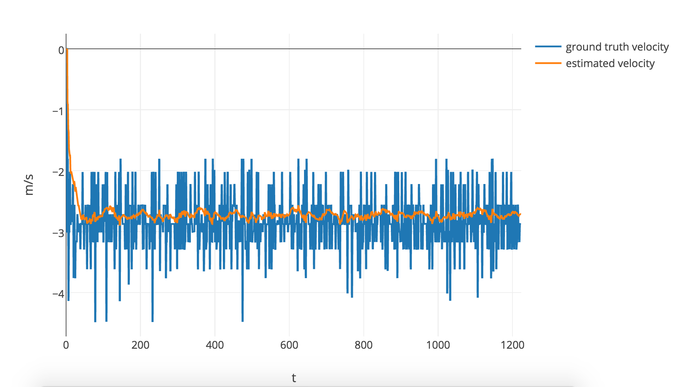

# Unscented Kalman Filter Project Starter Code
Self-Driving Car Engineer Nanodegree Program

---

## Results

### Data Set 1

#### RMSE
|     | RMSE      |
| --- |:---------:| 
| px  | 0.0769815 | 
| py  | 0.0847679 | 
| vx  | 0.600495  | 
| vy  | 0.581772  | 

#### Estimated P-x

#### Estimated Velocity

#### Estimated Yaw Angle

### Data Set 2

#### RMSE
|     | RMSE      |
| --- |:---------:| 
| px  | 0.18484   | 
| py  | 0.199843  | 
| vx  | 0.336247  | 
| vy  | 0.461792  | 

#### Estimated P-x

#### Estimated Velocity

#### Estimated Yaw Angle

## Dependencies

* cmake >= v3.5
* make >= v4.1
* gcc/g++ >= v5.4

## Basic Build Instructions

1. Clone this repo.
2. Make a build directory: `mkdir build && cd build`
3. Compile: `cmake .. && make`
4. Run it: `./UnscentedKF path/to/input.txt path/to/output.txt`. You can find
   some sample inputs in 'data/'.
    - eg. `./UnscentedKF ../data/sample-laser-radar-measurement-data-1.txt output.txt`

